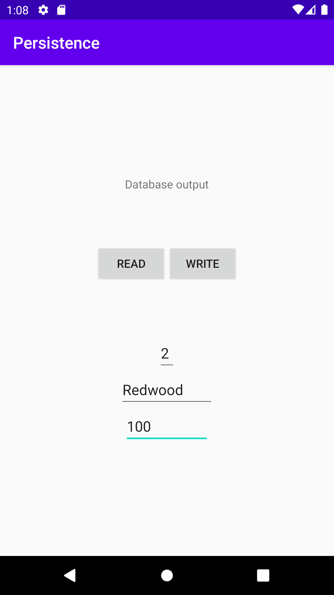

# Rapport

Denna uppgift gick ut på att via SQLite skriva och hämta data. Denna uppgiften använde sig utav classen Mountain som data. En class DatabaseTables
skapades där databasens tabeller definierades. I classen DatabaseHelper hanteras t.ex. om databasen inte finns eller om någon version har ändrats.
För att skriva data till databasen krävs ett id som är högre än alla tidigare raders id. När användaren klickar på "write" hämtas då datan i
EditText-rutorna och skickas in i databasen. När användaren trycker på knappen "Read" hämtas all data som finns i databasen och skrivs ut på egen rad
i TextViewn.


MainActivity:

```
    private TextView textView;
      private Button readButton;
      private Button writeButton;
      private EditText edit1;
      private EditText edit2;
      private EditText edit3;

      private SQLiteDatabase database;
      private DatabaseHelper databaseHelper;
      private ArrayList<Tree> listOfTrees;

      @Override
      protected void onCreate(Bundle savedInstanceState) {
          super.onCreate(savedInstanceState);
          setContentView(R.layout.activity_main);

          listOfTrees = new ArrayList<>();

          textView = findViewById(R.id.textView);
          readButton = findViewById(R.id.read);
          readButton.setOnClickListener(new View.OnClickListener(){

              @Override
              public void onClick(View view) {
                  listOfTrees = getTrees();
                  populateTextView(listOfTrees);
              }
          });
          writeButton = findViewById(R.id.write);
          writeButton.setOnClickListener(new View.OnClickListener(){

              @Override
              public void onClick(View view) {
                  writeData();
              }

          });

          edit1 = findViewById(R.id.edit1);
          edit2 = findViewById(R.id.edit2);
          edit3 = findViewById(R.id.edit3);

          databaseHelper = new DatabaseHelper(this);
          database = databaseHelper.getWritableDatabase();
      }


      private void populateTextView(ArrayList<Tree> list){
          textView.setText("");
          for (Tree tree : list) {
              textView.append(tree.getName() + " has a height of: " + tree.getHeight() + "\n");
          }
      }

      public void writeData() {
          addTree(Integer.parseInt(edit1.getText().toString()), edit2.getText().toString(), Integer.parseInt(edit3.getText().toString()));
      }

      private long addTree(int id, String name, int height) {
          ContentValues values = new ContentValues();
          values.put(DatabaseTables.Tree.COLUMN_NAME_ID, id);
          values.put(DatabaseTables.Tree.COLUMN_NAME_NAME, name);
          values.put(DatabaseTables.Tree.COLUMN_NAME_HEIGHT, height);
          return database.insert(DatabaseTables.Tree.TABLE_NAME, null, values);
      }

      private ArrayList<Tree> getTrees() {
          Cursor cursor = database.query(DatabaseTables.Tree.TABLE_NAME, null, null, null, null, null, null);
          ArrayList<Tree> trees = new ArrayList<>();
          while (cursor.moveToNext()) {
              Tree tree = new Tree(
                      (int) cursor.getLong(cursor.getColumnIndexOrThrow(DatabaseTables.Tree.COLUMN_NAME_ID)),
                      cursor.getString(cursor.getColumnIndexOrThrow(DatabaseTables.Tree.COLUMN_NAME_NAME)),
                      cursor.getInt(cursor.getColumnIndexOrThrow(DatabaseTables.Tree.COLUMN_NAME_HEIGHT))
              );
              trees.add(tree);
          }
          cursor.close();
          return trees;
      }

```


Data som ska matas in i databasen:




Data som hämtats från databasen:

